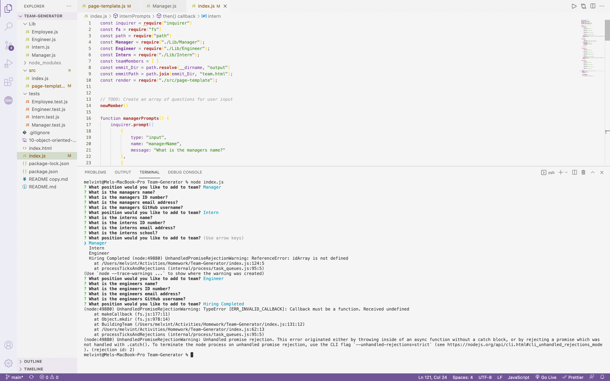

# Team-Generator
Creating a team using node

## Table of Contents

1.[Description](#Description)

2.[Screen Shots](#Screenshots)

3.[License](#License)

4.[Usage](#Usage)

5.[Badges](#Badges)

## Description
Trial and error

## Screenshots

Walk Through Video :

https://user-images.githubusercontent.com/85262817/133938733-2cf1b24d-cb1a-4b37-8e63-a46b8657bdf7.mp4

=======

## License
(MIT)

## Usage

## Badges
(JavaScript, Node.js)
